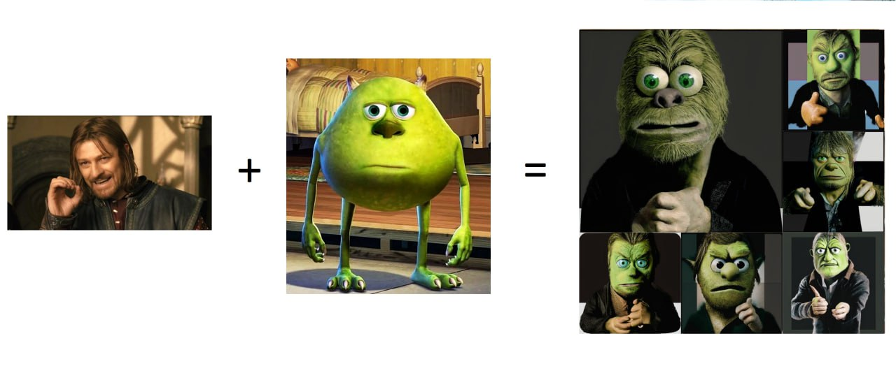
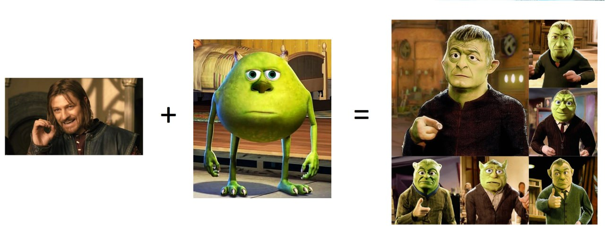
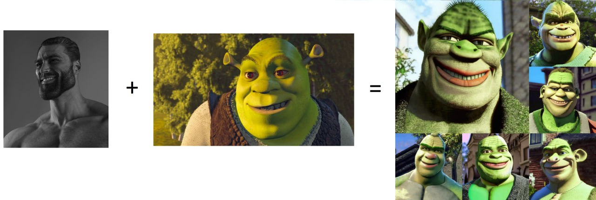

### About

Основная идея была реализовать следующий пайплайн:

1) Генерация описаний content + style с помощью BLIP
2) Удаления фона с картинок
3) Style Transfer с помощью kadinsky на картинках с удаленным фоном
4) Генерация фона для 3), опять же с помощью Kadinsky

Также результаты будут представлены обычной модели kadinsky, без использования пайплайна выше

### Результаты работы:


### Используя пайплайн:



### Без использования  пайплайна, обычный подбор гиперпараметров:





### Installation:

### [Colab work example](https://colab.research.google.com/drive/1he4r_R_bJ5BV5KhidlohFtVN2MtgnLaS?usp=sharing)

### PreRequirements:
pytorch >=1.6.0 builds with cuda support

### Installation:

```bash
pip install -r requirements.txt
```

### Testing locally

```bash
python run.py images/boromir.jpeg images/vazovski.jpeg
```